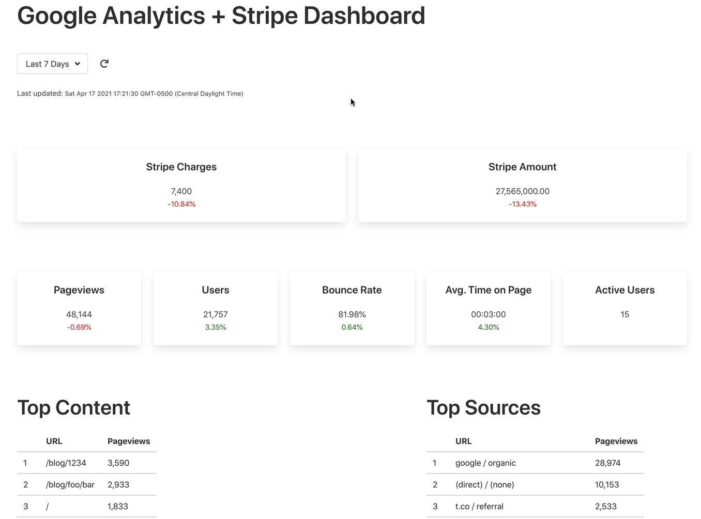

# Google Analytics + Stripe Dashboard

Simple Google Analytics dashboard

## Setup

First, rename *.env.dev-sample* to *.env.dev*.

Create a new project on [Google Developers Console](https://console.cloud.google.com/apis/dashboard), generate credentials, and download and save the *client_secrets.json* file to the "project" directory. Enable the Analytics Reporting and Google Analytics APIs.

Update the `GA_VIEW_ID` environment variable with your Google Analytics view ID in *.env.dev*.

Assuming you have a Stripe account configured, add the secret key to *.env.dev*.

Build the image and spin up the container:

```sh
$ docker-compose up -d --build
```

Create the database tables:

```sh
$ docker-compose exec web python manage.py create_db
```

View the dashboard at [http://localhost:5004/](http://localhost:5004/).

## Example


